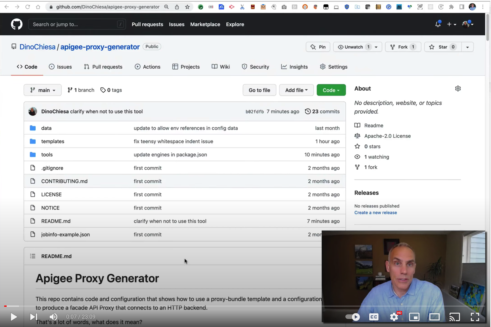

# Apigee Proxy Generator

This repo contains code and configuration that shows how to use a proxy-bundle
template and a configuration file to produce a facade API Proxy that connects to
an HTTP backend.

That's a lot of words, what does it mean?

The template is an "exploded" set of files that define an API Proxy bundle.
Each file is treated as a "template". At generation time, the tool applies a set
of configuration data (you might call it a "profile") to the template files. The
result is an actual proxy bundle, with all the template fields "filled in" by
the configuration or profile information.

## A Screencast Explains

If you don't want to read through this entire readme, you can [watch a screencast.](https://youtu.be/WDhX02iB864)

[](https://youtu.be/WDhX02iB864)


## What Good is This?

A good application of this idea, _but not the only application_, is easily
exposing a curated set of BigQuery queries, via an API Proxy, possibly protected
by an application credential like an API key or an OAuth token.

For example, you could write a data file that includes a few parameterized queries, like this:
```json
{
  "proxyname" : "flightdata",
  "basepath"  : "/flightdata",
  "projectId" : "my-project-id",
  "flows" : [
    {
      "name" : "airlines500",
      "path" : "/airlines500",
      "query" : "SELECT airline, code FROM [bigquery-samples.airline_ontime_data.airline_id_codes] WHERE airline != 'Description' group by airline, code order by airline limit 500"
    },
    {
      "name" : "airport-counts",
      "path" : "/airports/{airport}/counts/{departure_date}",
      "query" : "SELECT airline, count(*) AS total_count FROM  `bigquery-samples.airline_ontime_data.flights` WHERE departure_airport = @airport AND date = @departure_date GROUP BY airline"
    }
  ]
}
```

...and then run that file through a tool, which generates an API proxy that
exposes THOSE particular queries via an Apigee-hosted API.

But this approach can be useful in lots of other cases.


## Limitations

The concept of templatized generation of Apigee proxies can work with Apigee hybrid or Edge.

But, some of the templates in this repo - for example the templates that connect to
BigQuery - take advantage of the GoogleAuthentication feature that is available
only in Apigee X.

## Generating Proxies via Templates, in more detail

Templating in general is a useful technique. The idea is to combine a fixed set
of data (the template) with a variable set of data (the configuration? or the
data model) to produce something that is unique, and yet follows a formal
pattern. Performing this "combination" is sometimes described as _evaluating the
template against the data model_.

Templating is useful when producing Apigee proxies. A simple template approach
might be to fill in placeholder fields with values from the configuration
data. For example, when applying the template, a placeholder like `{{=
basepath}}` in a proxy template file would be replaced with the value of the
basepath property in the configuration data file. So, given this
template:

```
<ProxyEndpoint name="endpoint1">

  <HTTPProxyConnection>
    <BasePath>{{= basepath}}</BasePath>
  </HTTPProxyConnection>
  ...
```

And this configuration data:
```
 {
  "proxyname" : "flightdata",
  "basepath"  : "/flightdata",
  ...
```

The output would be:
```
<ProxyEndpoint name="endpoint1">

  <HTTPProxyConnection>
    <BasePath>/flightdata</BasePath>
  </HTTPProxyConnection>
  ...
```

When constructing API Proxies via templates, the template should hold the "boilerplate"
that you want to be common to all proxies. This boilerplate might include:
- a policy to verify required input credentials
- FaultRules for standard fault handling
- a Quota for common rate limiting
- policies to collect logging information
- and so on

In templating, a single string is often used as the template. Or maybe a single file.  With Apigee, we want the exploded
proxy _bundle_ - all of its files - to act as the template. The act of evaluating the template would
apply the data iteratively over each file in the bundle.

Static placeholder replacement, like replacing `{{= basePath}}` with a specific value, is handy but limited. For example:

- You can't use static templating to construct proxies that have varying numbers of conditional flows.
- With static templating, you can't conditionally include segments of the template.

To address that limitation, most modern templating engines have more
dynamic capabilities.

The tool in this repo uses
[nodejs](https://nodejs.org/en/) and the
[lodash](https://lodash.com/docs/4.17.21#template) package for templating, which
includes capabilities like looping, conditionals, and arbitrary JavaScript
logic. This gives much more flexibility in what the template can do.

For example, a template can include logic that would:

- loop through a set of "flows" listed in the configuration data
- emit a unique Flow element in the generated ProxyEndpoint for each one
- emit a distinct set of policy files to be embedded in each distinct Flow
- conditionally emit _some_ policies in some flows.
- and so on.

This is starting to get interesting!

The tool in this repo that applies the template is generic. The template itself
and the configuration that gets applied, can vary, for different purposes. There
are a few example templates here, and a few different configurations for data to
apply to those templates.  But these are intended to be illustrations. You could
write your own templates and your own configuration data, too.

I hope you will be able to re-use the tool and the technique.

## Why use a Template?

Writing a template, and then separating out configuration data (like the BQ
queries) from that template, is more complicated than just writing the
configuration for an API proxy, directly. So why do it? Why go to the trouble?

A couple reasons you'd want to write a template and "genericize" the proxy bundle:

1. If you have a number of different data sources or data sets, and want to
   produce similarly-structured API proxies across those data sets, minimizing
   repetitive effort.

2. If the people who maintain Apigee, the API platform, are different than the
   people who publish the Data APIs. The former group knows ProxyEndpoints,
   Flows, and context variables. The latter group might be data engineers, who
   know SQL and database tables and views. Or they might be services developers,
   who know their services and the paths they want to expose.  You don't want to
   cross train these people on Apigee, just to allow them to expose APIs.

In either of these cases, you might want to take the extra effort
to employ templates for your API proxy generation.

## When would you NOT want to use this generator?

Don't use this generator if you don't want to expose a limited, "curated" set of
queries. In other words, if you want the client to continue to use the full
interface for the upstream API (like BigQuery, etc)....  with all of the
combinations of {verb, payload, headers, path} that are supported by that
upstream system, then you can do that with Apigee, but you don't need this
generator tool to support that effort.

If you have that need, then your task is much simpler.

Suppose you want to expose BigQuery to a client, and all you want to do is
inject APIKey verificiation.  For that, you would just configure the Apigee
proxy to act a "passthrough proxy", meaning it would not manipulate the verb or
path or payload at all.

All the Apigee proxy would do is:
1. verify the API key,
2. remove the API key header, inject an Authorization header containing a token good for BQ
3. invoke the BQ Rest API with whatever verb and headers and payload the client passed to Apigee.

It would be only slightly different from letting the client app invoke the
bigquery.googleapis.com endpoint directly: the authentication token would be
different.

But if you want a more generic approach for building API Proxies, then... this
templating tool might be interesting to you.


## Example Templates Included here

There are two templates [included here](./templates):

1. [**BigQuery Facade Proxy**](./templates/bq-simple-proxy-template)

   This is a simple facade proxy for queries against BigQuery.  The generated
   proxy exposes a curated set of queries against BQ, each one as a different
   flow in the proxy endpoint. The target is bigquery.googleapis.com .

   This example shows how you can generate numerous different
   simple facade proxies against different BQ datasets, with specific,
   possibly parameterized queries for each one.

2. [**BigQuery Rate Limiting Proxy**](./templates/bq-rate-limiting-proxy-template)

   This is an extension of the above. The basic idea is the same: it's a facade
   for curated BQ queries. But, this one uses the Apigee builtin Quota policy,
   with the `EnforceOnly` and `CountOnly` features on the request flow and the
   response flow respectively, to enforce a rate limit.  The `CountOnly` uses a
   `MessageWeight` that is dynamically determined from the `totalSlotMs` of the
   BQ Query.

   This example uses an `account-num` request header as the Quota identifier.
   In a real system, that should be replaced with an Application ID, or Partner
   ID, etc, as appropriate. That identifier would be derived from the app
   credential (token or key).

3. [**BigQuery APIKey Proxy**](./templates/bq-apikey-proxy-template)

   Here, this is a facade
   for curated BQ queries. But, it also verifies an API Key presented in the
   `X-APIKey` header. This proxy performs no rate limiting.

4. [**BigQuery APIKey Rate Limiting Proxy**](./templates/bq-apikey-rate-limiting-proxy-template)

   This one is a combination of #2 and #3 above: it performs API Key verification,
   and also performs rate limiting.

You could create other proxy templates. The templates you create don't need to
point to BigQuery.

## Example Configuration Data

There are 3 distinct configurations here:

1. [**flights**](./data/config-bq-flights.json)

   Queries the airline flights sample dataset in BQ.

2. [**open-images**](./data/config-bq-open-images.json)

   Queries the open images public dataset in BQ.

3. [**covid19**](./data/config-bq-covid19.json)

   Queries two different public datasets in BQ related to Covid19.


Have a look at the open-images configuration. It's quite simple:
```json
{
  "proxyname" : "openimages",
  "basepath"  : "/openimages",
  "projectId" : "{{= env.PROJECT_ID}}",
  "flows" : [
    {
      "name" : "images-by-keyword",
      "path" : "/images-by-keyword/{keyword}",
      "wildcard-params" : ["keyword"],
      "query" : "SELECT original_url, title FROM `bigquery-public-data.open_images.images` where LOWER(title) LIKE @keyword LIMIT 50"
    }
  ]
}
```

There are four top-level properties. The first two are self-explanatory.

The third, `projectId` takes a value which might look strange: `{{=
env.PROJECT_ID}}`.  This is a reference to an environment variable by that
name. At runtime, the tool will replace that notation with the value of the
`PROJECT_ID` environment variable.

The final property is `flows`. The template can refer to this array to emit a conditional flow for each element here.
In this configuration, there is just one element within the `flows` array property. It defines the
information needed for a specific conditional flow, including the path pattern, and the query to use.

When the tool runs, it might:

* emit a Conditional flow like this:
  ```
    <Flow name="airlines32">
      <Condition>proxy.pathsuffix MatchesPath "/images-by-keyword/*" and request.verb = "GET"</Condition>
      ...
    </Flow>
  ```

* include a policy that extracts the path parameter and applies it to the parameter `@keyword` that is used in the query.


By following this pattern, you can build a REST model on top of curated queries.
Your URL path can use more than one named parameter. And you can add more flows
by inserting additional elements with distinct queries and path patterns. The
other example configurations included here have more flows.

## Using the generator tool

The [proxy generator tool](./tools/genProxyFromTemplate.js) included here does these things:

- generates the templatized proxy, by combining a template against a specific configuration.

- optionally, imports & deploys the proxy, to the given organization + environment, with the specified service account.


You'll need a relatively recent version of node and npm to run this tool.

1. First, Create service account

   Create a service account that the proxy will "act as", when it sends the queries to BigQuery.
   This account will need the "Big Query Job User" role in the GCP project.
   You can use the [GCP cloud console UI](https://console.cloud.google.com), or
   the [gcloud command-line tool](https://cloud.google.com/sdk/gcloud), to do
   this.

   You do not need to create or download a service-account key.

   **NB**: This example works only against Apigee X, and depends on a feature particular
   to Apigee X.


2. Generate a proxy, and import & deploy it.

   This shows how to generate a Data API proxy for the "flights" data from the
   "simple" BQ facade template.

   ```
   cd tools
   npm install

   # set shell variables
   TOKEN=$(gcloud auth print-access-token)
   SVCACCT=bq-reader@$PROJECT.iam.gserviceaccount.com
   ENV=your-env
   export PROJECT_ID=your-apigeex-org-name

   ## generate, import and deploy
   node ./genProxyFromTemplate.js -v \
     --token $TOKEN \
     --apigeex \
     --org $PROJECT_ID \
     --env $ENV \
     --source ../templates/bq-simple-proxy-template \
     --config ../data/config-bq-flights.json \
     --serviceaccount $SVCACCT
   ```

   Note: if you do not specify the `--env` option, the tool will import the
   generated proxy bundle to your organization, but won't deploy it.

3. Invoke some queries
   ```
   endpoint=https://my-apigeex-endpoint.net
   curl -i $endpoint/flightdata/airlines32
   curl -i $endpoint/flightdata/airlines100
   curl -i $endpoint/flightdata/airports/SEA/counts/2008-05-13
   curl -i $endpoint/flightdata/airports/LGA/counts/2010-02-11
   ```

## For the Rate Limiting Proxy

You can generate, import, and deploy the rate-limiting proxy like this:

```sh
node ./genProxyFromTemplate.js -v \
  --token $TOKEN \
  --apigeex \
  --org $PROJECT_ID \
  --env $ENV \
  --source ../templates/bq-rate-limiting-proxy-template \
  --config ../data/config-bq-flights.json \
  --serviceaccount $SVCACCT
```

In this example, the rate limiting is hard-coded to 5000 "totalSlotMs units" per
hour.  This is probably something you would want to configure in the API
Product, or in the App, or on the Developer entity.  This is pretty standard
practice with Apigee.

The proxy uses the `account-num` request header as the Quota identifier. When
you invoke it, pass that header.  Any value will do:

```sh
curl -i -H account-num:A1234567 $endpoint/flightdata/airlines100
curl -i -H account-num:A1234567 $endpoint/flightdata/airports/LGA/counts/2010-02-14
curl -i -H account-num:A1234567 $endpoint/flightdata/airports/EWR/counts/2010-02-14
```

For those last two queries, you can see the URL path includes parameters. The first
positional param is a 3-letter airport code. Try LGA, EWR, SEA, SJC, SFO, and so
on.  The latter field is a date. This flight data is old, so you can use dates
in the 2008-2011 range, I think. The format is YYYY-MM-DD.

If you invoke enough _unique_ queries, you will see a 429 response when the Quota
is exceeded. BQ will respond from cache when you send the same query repeatedly,
and those requests do not result in decrementing from the Quota count.

## For the proxy that checks API Keys

There are two templates that check APIKeys. One does rate limiting and one does
not.  For either of these, you need to pass the `X-APIKey` header, in place of
the `account-num` header. That API Key needs to be a real APIKey provisioned in
Apigee. The API Product should include the appropriate proxy (like flightdata,
etc).

Once the proxy is imported and deployed, invoke it like this:

```sh
curl -i -H x-apikey:$APIKEY_HERE $endpoint/flightdata/airports/LGA/counts/2010-02-14
curl -i -H x-apikey:$APIKEY_HERE $endpoint/flightdata/airports/EWR/counts/2010-02-14
```

## Generate only

To only generate the proxy, without importing and deploying it, specify the `--generateonly` option:

```sh
node ./genProxyFromTemplate.js \
    --generateonly \
    --source ../templates/bq-simple-proxy-template \
    --config ../data/config-bq-flights.json
```

The result will be an API Proxy bundle zip.

## Extending This Demonstration

You can build your own proxy templates. They do not need to connect to
BigQuery. Follow the examples given here.  Use your imagination!

The tool will process each file in your proxy template as a lodash template. The
logic is something like this:

```
  read in the configuration data
  combine that with the shell environment variables

  for each file in the template
    read in the text
    use lodash to fill evaluate that text as a template, using the config data
    write the result of that evaluation to a temporary directory

  zip up the results of all of those evaluations into a proxy bundle
```

During template evaluation, any JS in the template file can use the following
npm imports: fs, path, lodash.

For example, you can use `fs.writeFileSync()` to conditionally generate policy
files that might need to be included into the generated proxy. There are example
templates in this repo that do this.


## License

This material is [Copyright 2018-2022 Google LLC](./NOTICE).  and is licensed
under the [Apache 2.0 License](LICENSE). This includes the nodejs code as well
as the API Proxy configuration.

## Disclaimer

This example is not an official Google product, nor is it part of an
official Google product.


## Author

Dino Chiesa   
godino@google.com

## Bugs

- ??
